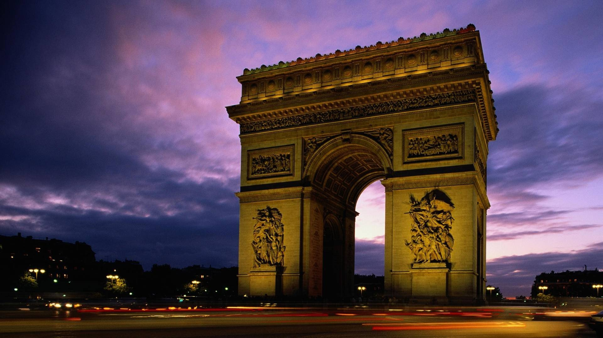
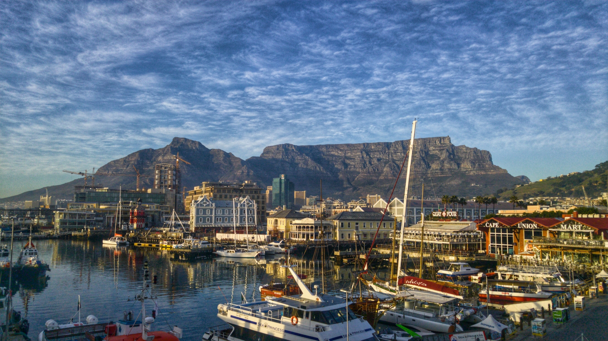

# Travel Destinations Carousel


## Live Demo
[View Live Demo](https://travel-destinations-gamma.vercel.app/)

## Description
This project is a carousel design slider showcasing beautiful travel destinations around the world. It includes smooth animations, functional buttons, and responsive design to provide an engaging user experience.

## Features

### Animation
- **Smooth Transitions**: The carousel transitions between slides with smooth animations for images, text, and buttons.
- **Text Animation**: Each content block animates into view with a combination of opacity and transform animations.
- **Button Hover Effects**: Buttons have hover effects that change their background color and text color.

### Functionality
- **Automatic Slide Transition**: The slider automatically transitions to the next slide after a set interval.
- **Manual Navigation**: Users can manually navigate through the slides using the next and previous buttons.
- **Thumbnail Navigation**: Thumbnails of the slides are displayed at the bottom, reflecting the current slide in view.

### Responsiveness
- **Responsive Design**: The carousel layout adjusts to different screen sizes, ensuring a good user experience on both desktop and mobile devices.
- **Adaptive Text Size**: The text size adapts to smaller screens to maintain readability without overlapping.

## Destinations
The carousel features the following travel destinations:
1. **Paris, France**: Iconic landmarks like the Eiffel Tower, Louvre Museum, and Notre-Dame Cathedral. Charming streets and the Seine River.

    
2. **Tokyo, Japan**: Blend of traditional and modern life. Street life, temples, Japanese cuisine, gardens, and Tokyo Tower.

    
3. **Sydney, Australia**: Stunning harbor, Sydney Opera House, Harbour Bridge, Bondi Beach, and coastal views.

    
4. **New York, USA**: Times Square, Central Park, Statue of Liberty, museums, Broadway shows, and nightlife.

    
5. **Rome, Italy**: Colosseum, Vatican City, Roman Forum, Italian cuisine, and lively piazzas.

    
6. **Cape Town, South Africa**: Table Mountain, Cape of Good Hope, Robben Island, Waterfront, and scenic drives.
    
    

## HTML Structure
The HTML structure includes:
- A header with navigation links.
- A carousel container with a list of slides, each containing an image, content, and buttons.
- A thumbnail container displaying thumbnails of the slides.
- Navigation buttons for manual slide transition.
- A time indicator for the automatic slide transition.

## CSS Animations
The CSS animations include:
- `showContent`: Animates the content into view.
- `showImage`: Transitions the images smoothly.
- `showThumbnail`: Reveals the thumbnails.
- `runningTime`: Manages the time indicator animation.

## JavaScript Functionality
The JavaScript handles:
- Automatic slide transitions using `setTimeout`.
- Manual navigation through `next` and `prev` button clicks.
- Resetting the carousel state after transitions.
- Ensuring smooth and seamless user interaction.

## Installation
1. Clone the repository:
   ```bash
   git clone https://github.com/anas-aqeel/frontend-projects.git
   cd HTML-CSS-JS
   cd tarvel-destinations
   ```
2. Open `index.html` in your browser to view the carousel.

## Usage
Simply navigate through the carousel using the next and previous buttons, or let it automatically transition between slides. Hover over the buttons to see the animation effects.

## License
This project is licensed under the MIT License.

---
