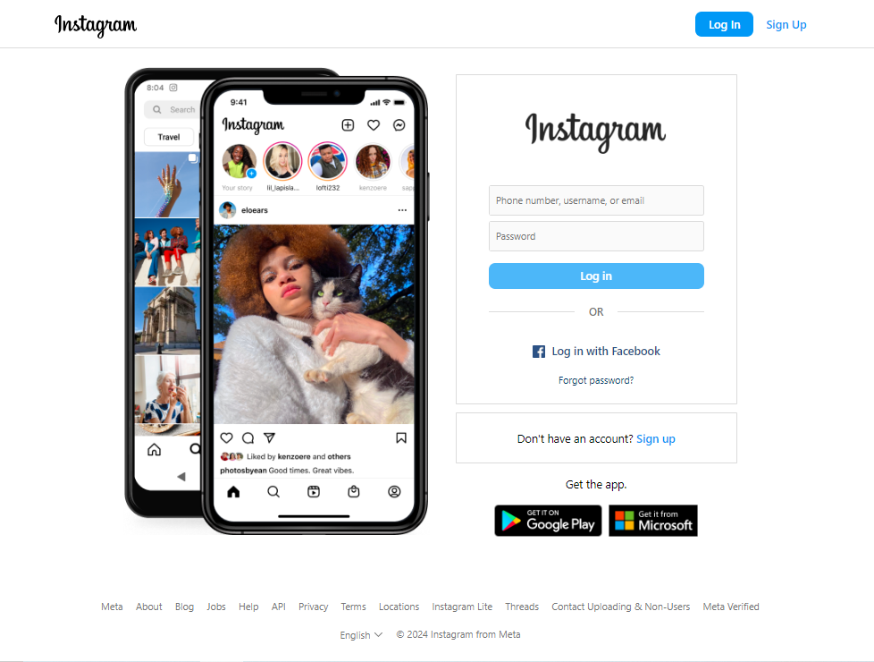

## Instagram Clone - Login Page

This project is a clone of the Instagram login page, created using HTML and CSS. It replicates the look and feel of the original Instagram login interface, including the logo, login form, and footer links. The page is designed to be responsive and adapts to different screen sizes.

### Features
- **Responsive Design**: The layout adjusts seamlessly for both desktop and mobile devices.
- **Login Form**: Includes fields for username/email and password, with a login button.
- **Alternate Login Options**: Provides a link for Facebook login and a "Forgot password?" option.
- **Sign-Up Prompt**: A section prompting users to sign up if they don't have an account.
- **App Download Links**: Includes links to download the Instagram app from the App Store and Google Play.
- **Footer Links**: Contains various informational and navigational links related to Instagram and Meta.

### Project Structure

```
instagram/
│
├── images/
│   ├── sketch.png
│   ├── favicon.webp
│   ├── fb-login.png
│   ├── insta-logo.png
│   ├── phone.png
│
├── index.html
├── readme.md
└── style.css
```

### Demo


### Live Link
Check out the live version of the project [here](https://instagram-five-phi.vercel.app).

